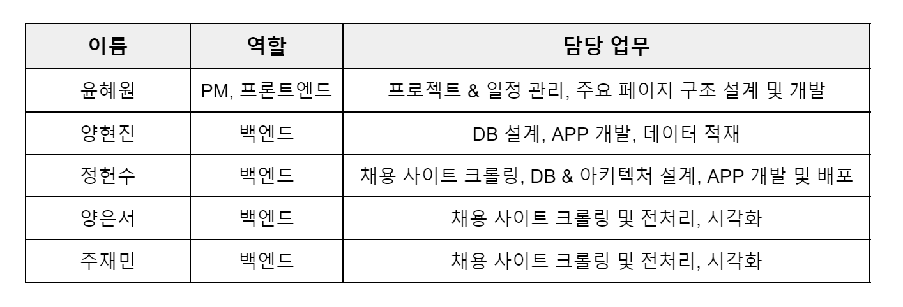

# [2기] 데이터 엔지니어링 데브코스 
**1차 프로젝트** : 크롤링한 웹 데이터로 만들어보는 웹사이트  
### **기간** : 2023.11.06 ~ 2023.11.10

 

# 목차
- [최종 결과물]()
- [프로젝트 명](#프로젝트-명)
- [프로젝트 개요 및 주제 선정 이유](#프로젝트-개요-및-주제-선정-이유)
- [기대효과](#기대효과)
- [참여자 정보 및 각 역할](#참여자-정보-및-각-역할)
- [활용 기술 및 프레임워크](#활용-기술-및-프레임워크)
- [소프트웨어 아키텍처 및 ERD](#소프트웨어-아키텍처-및-erd)
- [프로젝트 주요 구현 사항](#프로젝트-주요-구현-사항)
- [개발 협업 과정](#개발-협업-과정)
- [프로젝트 결론 및 개선 방안 논의](#2-회고-및-개선-방안-논의)

 

## 최종 결과물
### 도메인 : http://techrank.kro.kr/

 결과 페이지 시각화

 

## 프로젝트 명

#### 신입 개발 직군 취업을 위한 기술 스택 분석

 

## 프로젝트 개요 및 주제 선정 이유
최근 성별, 전공에 상관없이 취업을 위해 프로그래밍을 배우고자 하는 사람들이 늘어나고 있습니다. 그러나 지원하고자 하는 직무에 따라 필요한 기술 스택이 다르고, 기술 스택의 수 또한 많이 다양하기 때문에  실전 경험이 적은 신입의 입장에서 어느 기술 스택에 대한 학습을 우선시해야 할 지 난감해집니다.

**개발 직군으로 취업을 하고자 하는 신입 개발자에게 제일 필요한 것은 무엇일까?** 라는 고민에서부터 이번 프로젝트가 출발했습니다. 테크랭킹은 신입 개발자들의 고민을 조금이라도 덜어주고 싶었고,  그래서 채용 사이트의 신입 대상 채용공고를 기반으로 직무별로 현재 실제 기업에서 많이 쓰이는 기술 스택의 순위를 보여주는 웹 서비스를 기획하게 되었습니다. 

또한 우리 팀 모두 곧 신입 개발자가 될 예정이기 때문에, 이 프로젝트는 단순한 과제를 넘어 우리의 현실적인 관심사와 직결되어 있습니다. 이러한 개인적인 연관성은 우리가 프로젝트에 더욱 몰입할 수 있을 거라 생각합니다. 우리 자신의 경험과 기대를 프로젝트에 반영함으로써, 신입 개발자들의 실제 필요와 고민에 더욱 깊이 공감하고 그 해결책을 모색하고자 합니다.

 

## 기대효과
신입 개발자를 위한 서비스는 필요한 기술 스택을 식별하는 데 도움을 주고, 취업 시장의 최신 트렌드에 맞는 데이터를 시각화하여 제공함으로써, 효율적인 학습 경로를 제공하고 취업률 향상에 기여할 것으로 기대됩니다.

 

## 참여자 정보 및 각 역할

 

## 활용 기술 및 프레임워크

 

## 소프트웨어 아키텍처 및 ERD
### 소프트웨어 아키텍처

### ERD

 

## 프로젝트 주요 구현 사항
1. 채용 사이트에서 크롤링한 데이터를 의미 있는 정보로 가공한 후 장고의 커스텀 관리 명령을 정의하여 기업, 직무, 기술 스택에 대한 정보를 데이터베이스에 적재했습니다. 

1. 신입 개발자에게 필요한 다양한 기술 스택을 직무별과 기술 유형별로 분류한 뒤, 각 유형에서 가장 자주 언급되는 상위 5개 기술 스택을 선정하여 파이 차트로 시각화를 진행했습니다.

1. 특정 지역에서 크롤링한 시점 기준으로 현재 진행 중인 신입 개발자 채용 공고의 수를 확인할 수 있는 기능 구현했습니다.

1. 직무별 및 지역별로 선택이 가능한 페이지를 개발하고, 이를 별도의 결과 페이지와 연결하여 관련 차트를 표시하는 기능 구현했습니다.

1. 장고 자체는 웹 서버가 아니며, 대규모 트래픽 처리나 정적 파일의 효율적인 제공에 최적화되어 있지 않기 때문에 애플리케이션의 성능과 안정성을 높이기 위해 별도의 웹 서버와 WSGI 서버를 함께 구성해서 배포했습니다.

 

## 개발 협업 과정
### 노션을 사용하여 스탠드업 미팅의 내용을 기록하고, 이를 팀원들과 공유

### 슬랙을 활용하여 실시간 의사소통과 빠른 피드백 반영

### Trello를 활용하여 프로젝트의 진행 상황을 팀원들과 공유

 

## 프로젝트 결론 및 개선 방안 논의
### 1. 결론
이번 웹 개발 프로젝트에서 웹 크롤링 기술과 Django를 활용한 경험은 저희 팀원들의 개발 능력을 실질적으로 향상시켰습니다. 또한 다양한 협업 도구(Github, Trello, Notion, Slack)를 통해 팀원들과의 원활한 의사소통과 협력을 경험하며, 실무 프로세스에 대한 간접적인 이해를 얻을 수 있었습니다.

비록 팀원들과 처음 만나 어색했지만, 함께 문제를 해결하고 이슈를 공유하는 과정은 뜻깊었고, 이 과정은 실시간 의사소통, 배려 그리고 경청의 중요성을 다시 한번 일깨워주는 소중한 기회였습니다. 해당 교육 과정의 첫 프로젝트임에도 많은 것을 배우고 느낄 수 있었으며, 특히 시도하지 못한 부분들과 부족하다고 생각했던 부분에 대한 아쉬움이 컸던 것 같습니다. (로깅 처리, 에러 처리, CI/CD 등)

앞으로 진행할 프로젝트에서는 이러한 부족한 부분과 아쉬웠던 점들을 기록하며, 적극적으로 반영할 예정입니다.

  

### 2. 회고 및 개선 방안 논의

특정 소수의 채용 공고만 수집되어 데이터가 제한적이며, 이로 인해 세부 지역(시군구)별 분류가 어려웠습니다. 이는 데이터의 불균형을 초래하고 결과적으로 데이터 시각화가 만족스럽지 않게 나타날 수 있겠다라는 생각이 들었습니다. 이 문제는 다양한 채용 공고 사이트에서 더 많은 데이터를 수집함으로써 해결할 수 있을 것으로 보입니다.

다양한 사이트에서 채용 공고를 크롤링하여 많은 데이터를 수집하는 과정에서 여러 가지 이슈가 발생할 수 있다고 생각했습니다. 예를 들면, 동일한 기업명에 대해 주소가 다른 경우, 또는 기업명과 주소가 같지만 직무가 다른 경우가 있을 수 있습니다. 시도와 시군구만을 추출하는 경우에도, 주소와 직무는 같지만 기업명이 다를 수 있습니다. 이러한 문제들을 고려하여 데이터베이스를 설계하고 데이터를 적재하는 방식에 대해 심도 있는 고민과 계획도 필요하다고 생각합니다.

현재 애플리케이션에서는 특정 기능을 간소화하기 위해 기술 스택 데이터를 적재할 때 중복을 허용하고 있습니다. 하지만 이러한 중복을 허용하지 않고 해결할 수 있는 방법에 고민해볼 필요가 있겠다라는 생각을 했습니다.

데이터의 실시간성이 이 프로젝트에서 가장 중요한 요소라고 생각합니다. 현재는 프로젝트 시작 시점에 크롤링한 데이터를 기준으로 하고 있습니다. 그러나 나중에 변경되거나 새롭게 올라오는 채용 공고를 실시간으로 크롤링하여 반영할 수 있는 시스템 설계가 필요하다고 생각합니다. 시간 제약으로 인해 이 기능을 구현하지 못했지만, Django crontab과 custom commands를 사용하여 추후에 이를 개선할 수 있을 것으로 생각됩니다.

또한 더 나아가 Apache Kafa, GitHub Action, AWS Lambda, GCF 등, 이와  같은 기술을 적절히 조합하면, 변경되거나 새로 올라오는 채용 공고를 실시간으로 크롤링하고 반영하는데 필요한 시스템을 효율적으로 설계하고 구현할 수 있겠다라는 생각이 들었습니다. 

현재는 주로 웹 환경에 최적화되어 있지만, 사용자들이 언제 어디서나 편리하게 접근할 수 있도록 모바일 환경에서도 간편하게 확인할 수 있는 기능을 추가하는 것이 중요하다고 생각됩니다. 이렇게 하면 사용자 경험을 대폭 개선할 수 있으며, 모바일 사용자들의 접근성도 향상될 것 같다는 생각을 했습니다.

또한 해당 프로젝트에서 GitHub Actions를 활용하지 못한 점이 아쉬웠습니다. 이를 통한 CI/CD 파이프라인 구축은 프로젝트의 효율성과 신뢰성을 크게 향상시킬 수 있었을 것입니다. 앞으로는 이러한 자동화된 배포 및 테스트 접근 방식을 채택하여 개발 프로세스를 더욱 강화하고자 합니다.
